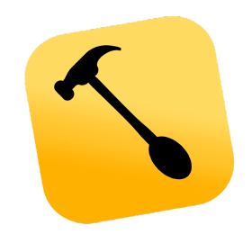

<table>
  <tr>
    <td></td>
    <td>
      <h2 align="center"><em>Hammerspoon libraries and ready-to-use Spoons for a sharper macOS workflow.</em></h2>
    </td>
  </tr>
</table>

This repository contains independent Hammerspoon Spoons. Each Spoon owns its
Lua runtime, configuration, data, tests, and detailed documentation; optional
Home Manager delivery loads those files and provides Gearbox's required
timeout, shared placement, and Scratchpad settings.

## Spoons

| Spoon | Purpose |
| --- | --- |
| [Gearbox](./Spoons/Gearbox/README.md) | Native keyboard launcher with nested menus, an editable scratchpad, arrow navigation, themes, and macOS power controls; inspired by [LeaderKey](https://github.com/mikker/LeaderKey) |

## Example

Copy a Spoon beneath `~/.hammerspoon/Spoons/`, then load it from
`~/.hammerspoon/init.lua`:

```lua
require("Spoons.Gearbox").start()
```

Gearbox intentionally ships with its timeout disabled, so set a positive
`menu.timeout` before loading it. The [Gearbox README](./Spoons/Gearbox/README.md)
contains installation, configuration, controls, and architecture details.
[Nix delivery](./assets/docs/NIX.md) is available through Home Manager.

## License

Copyright © 2025–2026 Martín Cigorraga. Released under the
[GNU Affero General Public License v3 or later](./LICENSE).
